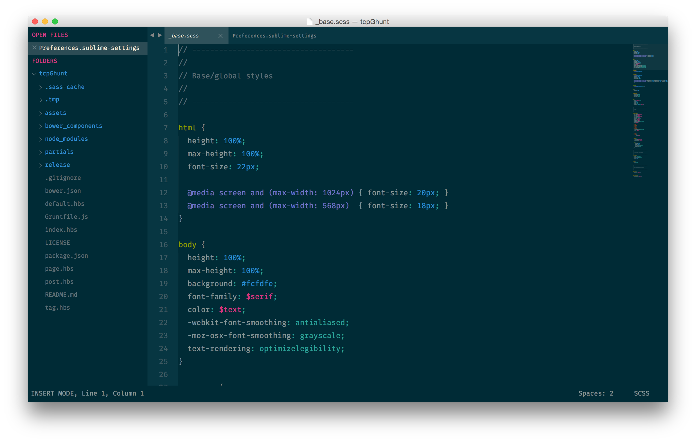
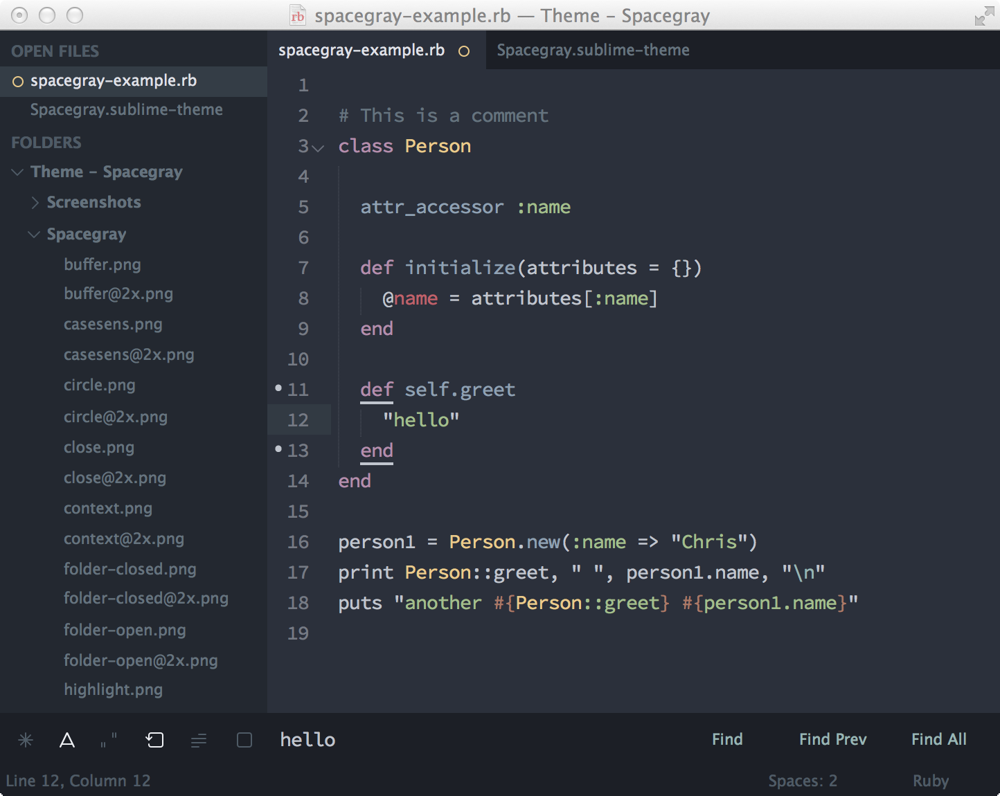
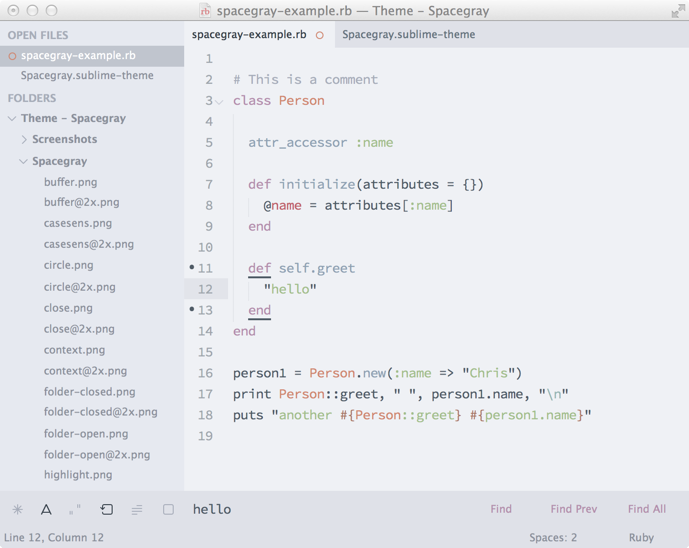
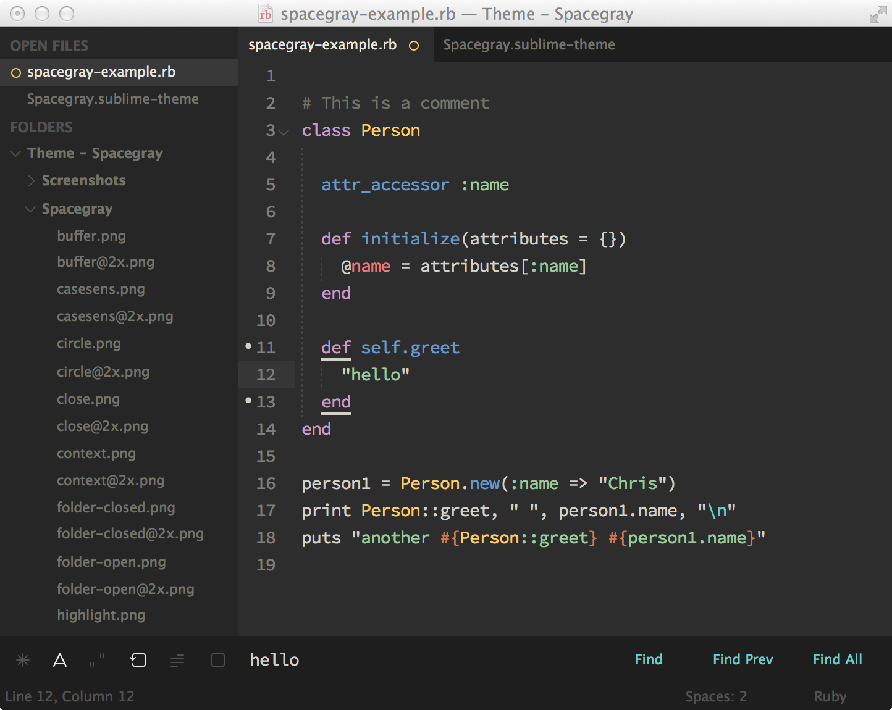

# Spacegray Solarized


A Solarized-flavoured port of the [Spacegray theme](http://kkga.github.io/spacegray/). Clone this repo (or [download the .zip](http://lab.colepeters.com/cole/tcpspacegraysolarized/repository/archive.zip?ref=master)) to get started (it’s not available on Sublime’s package manager because I am insanely lazy). Then follow the instructions as below, but instead use the following for your theme:

`"theme:" "Spacegray Solarized Dark.sublime-theme"`

…and be sure to set your colour scheme to:

`"color_scheme": "Solarized (dark) (SL).tmTheme"`

Enjoy! Original Spacegray README follows:

# Spacegray

A set of custom UI themes for Sublime Text 2/3. It's all about hype and minimal. Comes in different flavors with accompanying [Base16](https://github.com/chriskempson/base16) color schemes.

***

### Themes

#### Spacegray

Default flavor based on Base16 Ocean Dark color scheme.



#### Spacegray Light

Light variation based on Base16 Ocean Light color scheme.



#### Spacegray Eighties

A variation based on Base16 Eighties Dark color scheme.



*The font used in the screenshots is [__Source Code Pro__](https://github.com/adobe/Source-Code-Pro).*

***

### How to Install

#### Via Package Control

The easiest way to install is using [Sublime Package Control](https://sublime.wbond.net), where Spacegray is listed as `Theme - Spacegray`.

1. Open Command Palette using menu item `Tools -> Command Palette...` (<kbd>⇧</kbd><kbd>⌘</kbd><kbd>P</kbd> on Mac)
2. Choose `Package Control: Install Package`
3. Find `Theme - Spacegray` and hit <kbd>Enter</kbd>

#### Manual

You can also install the theme manually:

1. [Download the .zip](https://github.com/kkga/spacegray/archive/master.zip)
2. Unzip and rename the folder to `Theme - Spacegray`
3. Copy the folder into `Packages` directory, which you can find using the menu item `Sublime Text -> Preferences -> Browse Packages...`

***

### How to Activate

Activate the UI theme and color scheme by modifying your user preferences file, which you can find using the menu item `Sublime Text -> Preferences -> Settings - User` (<kbd>⌘</kbd><kbd>,</kbd> on Mac).

You can choose whichever flavor you like, but don't forget to change *both* color scheme and UI theme so they match.

***Note: Don't forget to restart Sublime Text after activating the theme.***

#### Settings for Spacegray

```json
{
  "theme": "Spacegray.sublime-theme",
  "color_scheme": "Packages/Theme - Spacegray/base16-ocean.dark.tmTheme"
}
```

#### Settings for Spacegray Light

```json
{
  "theme": "Spacegray Light.sublime-theme",
  "color_scheme": "Packages/Theme - Spacegray/base16-ocean.light.tmTheme"
}
```

#### Settings for Spacegray Eighties

```json
{
  "theme": "Spacegray Eighties.sublime-theme",
  "color_scheme": "Packages/Theme - Spacegray/base16-eighties.dark.tmTheme"
}
```

***

### Settings

#### Tab labels font size

Copy and paste one of four options in your user preferences file:

```json
  "spacegray_tabs_font_small": true
```
```json
  "spacegray_tabs_font_normal": true
```
```json
  "spacegray_tabs_font_large": true
```
```json
  "spacegray_tabs_font_xlarge": true
```

#### Tabs size

Tabs height:

```json
  "spacegray_tabs_small": true
```
```json
  "spacegray_tabs_normal": true
```
```json
  "spacegray_tabs_large": true
```
```json
  "spacegray_tabs_xlarge": true
```

Tabs width: 

```json
  "spacegray_tabs_auto_width": true
```

#### Sidebar labels font size

```json
  "spacegray_sidebar_font_small": true
```
```json
  "spacegray_sidebar_font_normal": true
```
```json
  "spacegray_sidebar_font_large": true
```
```json
  "spacegray_sidebar_font_xlarge": true
```

#### Sidebar tree rows height

```json
  "spacegray_sidebar_tree_xsmall": true
```
```json
  "spacegray_sidebar_tree_small": true
```
```json
  "spacegray_sidebar_tree_normal": true
```
```json
  "spacegray_sidebar_tree_large": true
```
```json
  "spacegray_sidebar_tree_xlarge": true
```

***

### Thanks

The Spacegray Eighties variation is contributed by [Yoshua Wuyts](https://github.com/yoshuawuyts).
